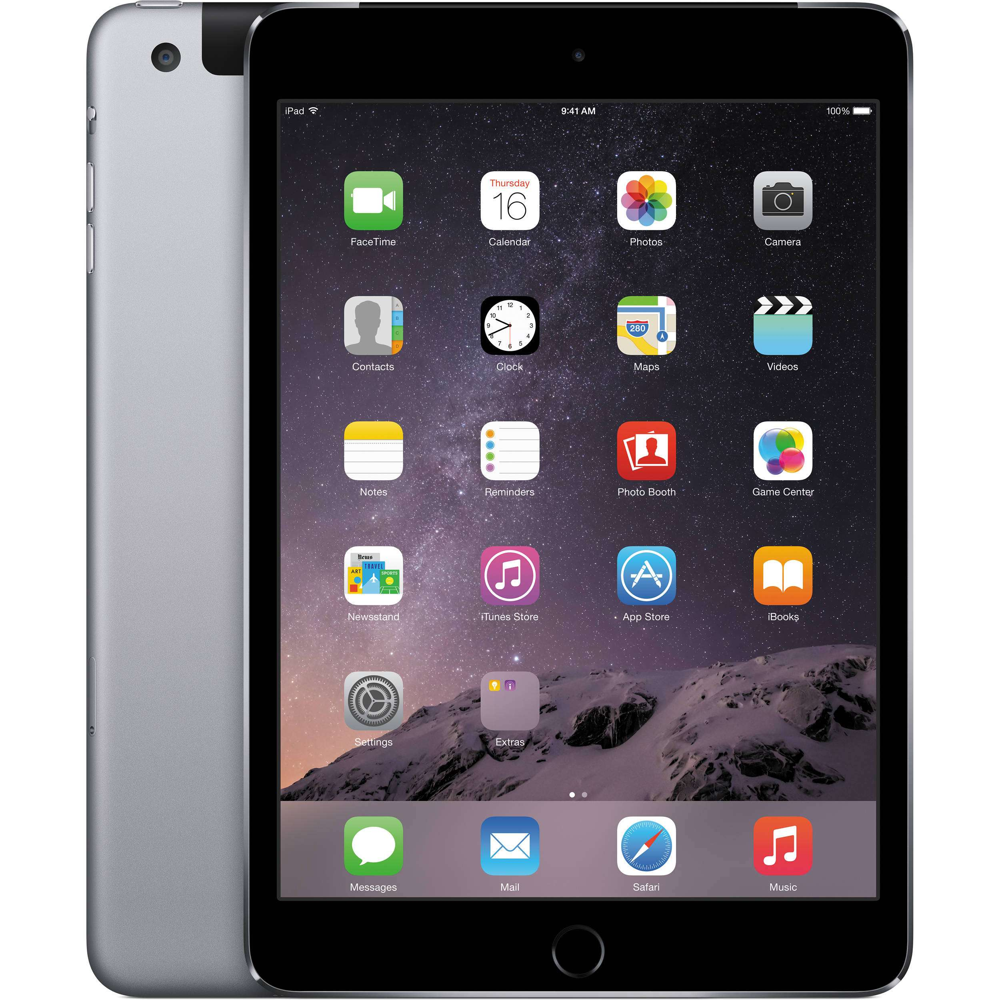

# Wymaganiaaaa

- działa
- ma rysik
- ma wsparcie dla folii paper-like
- ma sporo miejsca
- nadaje się do czytania
# Wyjaśnienia

## Nadchodzące
- spekuluje się, że nowa wersja iPada Air wyjdzie w październiku lub następnej wiosny
## Specyfikacje
- im dawniej tablet został wypuszczony, tym mniej aktualizacji dostanie; u Apple problem mniej zauważalny, iPady są wspierane dłużej
- prawdopodobnie będziemy chcieli minimum 128 GB miejsca, może więcej; bardzo zależy, ile plików i w jaki sposób chcesz przechowywać
- wymagana ilość RAM-u w tabletach z Androidem będzie większa niż w iPadach; im większe pliki, tym większe wymagania; w tych pierwszych prawdopodobnie 6 GB i więcej
- brak opcji odblokowywania odciskiem palca / skanem twarzy może być bardzo uciążliwy, jeśli planujesz zabezpieczyć tablet hasłem, co raczej jest rekomendowane
- mAh: pojemność baterii; z reguły iOS ma lepsze życie na baterii na jednostkę
- w iPadach opcja miejsca na kartę SIM kosztuje około 1 000 PLN więcej
- ceny nie zawierają klawiatury; jeśli takowej potrzebujesz, zintegrowana byłaby bardziej wygodna, osobne prawdopodobnie byłyby jakościowo lepsze i tańsze
- port USB-C do ładowania pozwolił by na posiadanie jednej ładowarki do telefonu i tabletu
- głośniki w iPadach są podobno cudowne
- przedstawione iPady mają refresh rate (jak często ekran się aktualizuje) 60 Hz, w porównaniu do 120+ w Androidach (choć to dość mało istotne do czytania)
## Ekran i rysik
- AMOLED & mini LED > OLED >> IPS
	- trzy pierwsze są zdecydowanie jaśniejsze, mają lepszy kontrast (czarne jest czarne, nie ciemnoszare)
- cale ("): przekątna ekranu
- nity: jasność ekranu
	- dla komfortowego korzystania na zewnątrz preferowanie 500 i wyżej
- istnieją tańsze alternatywy dla Apple Pencil, aczkolwiek będą one zauważalnie gorsze
	- Apple Pencil 1st gen ładuje się przez wpięcie przewodu w rysik, nie przez przystawienie go do boku tabletu

ała
## Akcesoria
- szukanie akcesoriów do iPadów może być uciążliwe ze względu na dość beznadziejny naming scheme; jeśli nie widzisz wyników, warto zmienić nazwę w wyszukiwaniu
	- przykładowo iPad Air 2022 to również iPad Air 10.9 oraz iPad Air 5
# iPad 9th gen / 10.2 | 3 748 PLN
https://www.apple.com/pl/shop/buy-ipad/ipad-10-2/256gb-gwiezdna-szaro%C5%9B%C4%87-wifi
- dużo folii
	- https://allegro.pl/listing?string=folia+ochronna+paperlike+ipad+9
- Październik 2021
- 10.2", IPS, 500 nitów
- Apple Pencil 1st gen
- Touch ID
- 256 GB / 3 GB, bez miejsca na kartę pamięci
- A13 Bionic / 8 557 mAh
	- raczej good enough
- Port lightning
### adnotacje
- ból rysika 1st gen
- na górze i dole dużo niewykorzystanego miejsca

- port lightning – konieczność osobnego przewodu do ładowania
- lepsze opcje nie są o wiele droższe

# iPad 10th gen / 10.9 | 4 553 PLN
https://www.apple.com/pl/shop/buy-ipad/ipad/256gb-srebrny-wifi
- dużo folii
	- https://allegro.pl/listing?string=folia+ochronna+paperlike+ipad+10
- Październik 2022
- 10.9", IPS, 500 nitów
- Apple Pencil 1st gen
- Touch ID
- 256 GB / 4 GB, bez miejsca na kartę pamięci
- A14 Bionic / 7 606 mAh
	- zdecydowanie good enough
- Port USB-C
### adnotacje
- ta opcja zdaje się być warta dodatkowych ~800 PLN
- rysik 1st gen

# iPad Air 2022 / Air 5 / Air 10.9 | 5 548 PLN
https://www.apple.com/pl/shop/buy-ipad/ipad-air/256gb-gwiezdna-szaro%C5%9B%C4%87-wifi
- dużo folii
	- https://allegro.pl/listing?string=folia+ochronna+paperlike+ipad+air+10.9
- Marzec 2022
- 10.9", IPS, 500 nitów
- Apple Pencil 2nd gen
	- (!)
- Touch ID
- 256 GB /  8 GB, bez miejsca na kartę pamięci
- M1, 7 600 mAh
	- uhuhu, overkill
- Port USB-C
### adnotacje
- największe różnice dotyczą specyfikacji (co raaaczej jest tutaj mniej istotne) oraz nowszej wersji rysika

# Xiaomi Pad 6

# Oneplus Pad

# Samsung Galaxy Pad S9

# Nazwa | cena
- folia paper-like
- release date
- ekran: przekątna, typ, jasność
- rysik
- dysk / RAM, sd card slot
- odblokowywanie
- ładowanie
- wydajność / battery life

+

–